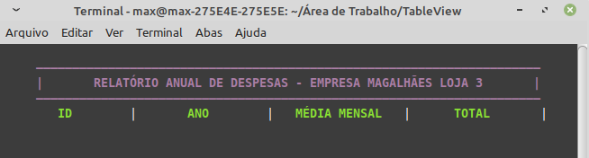

# MyColors-terminal
Projeto em python para imprimir fontes coloridas usando sequências de escape ANSI.
(OBSERVAÇÃO: Testado apenas no terminal linux usando Linux Mint)

## Instruções de uso:
<ul>
  <li>Baixe o arquivo "myColorsTerminal.py" e coloque-o nas pasta do seu projeto.</li>
  <li>Faça a importação no seu projeto conforme abaixo, ou como preferir.</li>
</ul>

<figure>
  
</figure>

### Segue abaixo a saída do código acima:
<figure>
  
</figure>

### Exemplo 2 da saída de código (um código qualquer):

<figure>
  
</figure>
